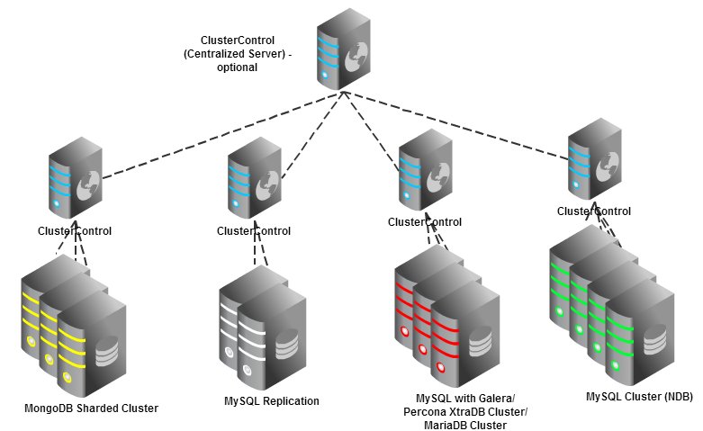
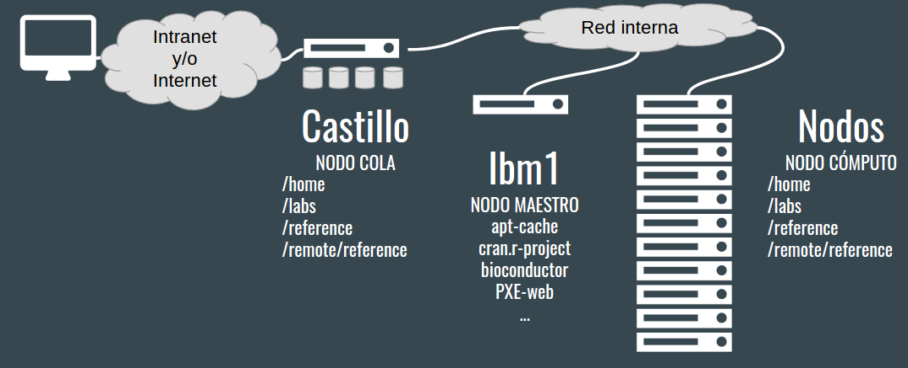
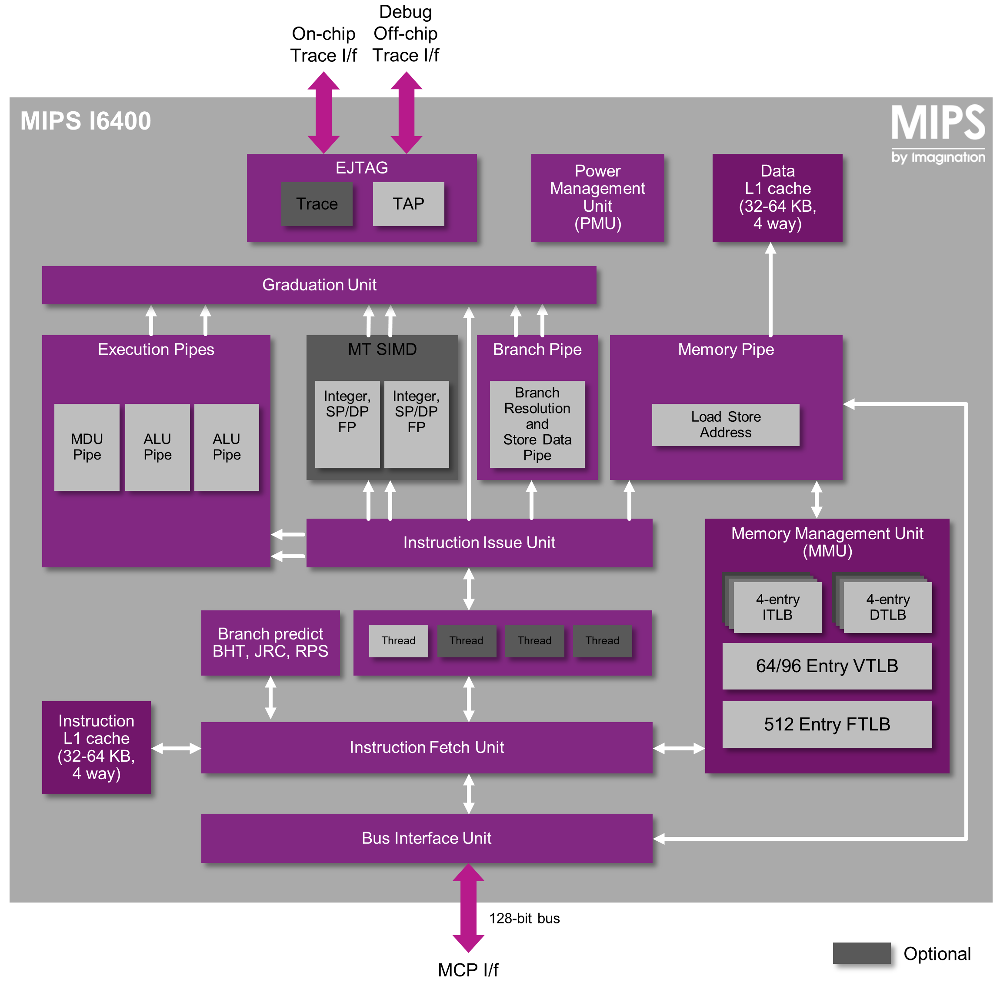
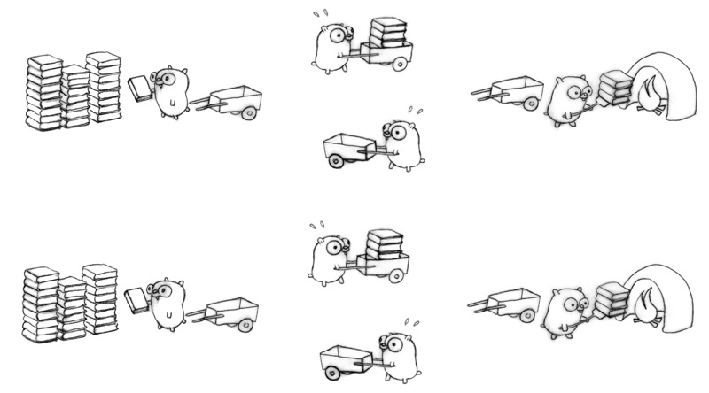

# Cosas que deben quedar claras

## Nube


## Servidor


## Clúster



# Clúster

## Arquitectura



## Cuellos de botella

- La parte más lenta de las computadoras es la lectura en disco.

- La siguiente es la comunicación (red, bus).

- El siguiente mayor problema es el algoritmo y el lenguaje de programación.

- **¡El algoritmo depende de la representación de los datos!**

## Lectura en disco / comunicación


## Lectura en disco / comunicación



## Lectura en disco / comunicación

Leer una vez, hacer todas las operaciones sobre la información de una sola vez.

### ¿Cómo?

- Probar que cada operación funciona correctamente por separado \
    (test cases).

- Usar un único ciclo para las operaciones \
    (`for { op1; op2; ...; todo; }` \
    `proceso1 | proceso2 | proceso3`).

## [Off Topic] Tips para programar

- Empezar a escribir el algoritmo en lenguaje natural.

- Hacer un ejemplo de entrada y salida esperada.

- Generar una prueba para verificar que funciona.

- *Únicamente cuando eso está claro* comenzar a escribir código.

## Lectura en disco / comunicación

- Empacar toda la información necesaria en un único lugar.

- Usar una estructura que permita la búsqueda (ordenar-indexar / estructurar).

- **¡El algoritmo depende de la representación de los datos!**

## Comunicación



## Lenguaje de programación

- Problemas sencillos es bueno resolverlos en cualquier lenguaje.

- Cuando el programa tarda mucho, optimizar traduciéndolo a lenguaje compilado.

## Algoritmo

> Cuando el programa tarda mucho incluso en lenguaje compilado,
>  el problema ~~es demasiado difícil~~ es el algoritmo.

## Algoritmo

\


- Si existe, usar otra estrategia para resolver el problema.

- Verificar si la estructura de datos es óptima para resolver el problema.

# Soporte

## Cómo reportar errores

[Cómo preguntar de manera inteligente (en inglés)](http://catb.org/~esr/faqs/smart-questions.html ) y
[traducción desactualizada al español](http://www.sindominio.net/ayuda/preguntas-inteligentes.html ).

## Cómo reportar errores

- Intentar resolver el problema leyendo el manual y buscando en google.

- ¡Dar detalles! (mientras más mejor):

    - La carpeta del proyecto (**con sus `README.md`**).

    - El comando exacto que se ejecutó ¿por condor? ¿en la consola? ¿interfaz gráfica?.

    - Mostrar el log/error completo (a veces pasas cosas por alto porque no sabes).

## Cómo podemos ayudar

- Ya tenemos [varios](https://github.com/INMEGEN?tab=repositories )
    [problemas ](https://github.com/xihh87?tab=repositories )
    [resueltos](https://github.com/hachepunto?tab=repositories )
    No reinventen la rueda.

- Revisar cuellos de botella en los flujos de trabajo.

- Sugerir alternativas para resolver los problemas.

- Verificar la forma de trabajo.

## Cómo podemos ayudar

- Unidad de Servicios Bioinformáticos.

- Unidad de Supercómputo.

## Cómo solicitar instalación de software

```
apt search [paquete]
```

Si el paquete ya está hecho, sólo es necesario pedirlo por correo indicando para qué proyecto se usará.

## Cómo solicitar instalación de software

Si no existe el paquete, solicitar por correo con detalles completos:

   - URL para descarga de código.

   - Lista completa de dependencias.

   - Procedimiento de instalación detallado.

*Paciencia*. Somos 3 personas haciendo un montón de cosas.
Mientras mejor documentado esté, más fácil será.

# ¿Dudas?
