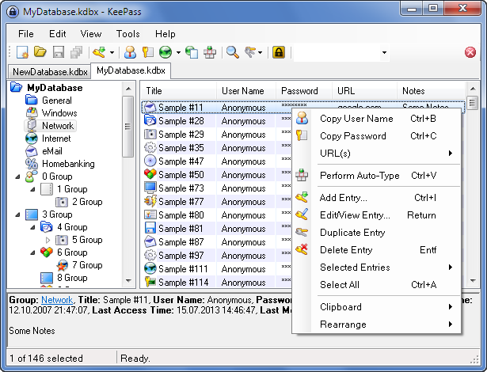

# Servidores remotos

## Un servidor es un computadora más grande

{width=10cm}

## Un clúster es un grupo de computadoras coordinadas para trabajar como una sola

{width=10cm}

## La nube es la computadora de alguien más

{width=10cm}

# Qué cuidar cuando comparto el uso de un servidor

## Para evitar que alguien más use mi cuenta, puedo usar éstos sistemas de seguridad

- Algo que sé (contraseñas).

- Algo que tengo (llaves).

- Algo que soy (huellas biométricas).

## Una buena contraseña es larga, aleatoria y única

{width=10cm}

## Para mantener muchas contraseñas seguras es recomendable usar un gestor de contraseñas

{width=8cm}

## Dos ejemplos de gestores de contraseñas

<http://keepass.info>

<https://www.passwordstore.org/>

## Una clave pública permite asegurar información para que sólo pueda leerla quien tenga la clave privada

{width=3cm}

{width=3cm}

# Confidencialidad

## Cada archivo que se guarda en unix está asignado a un usuario y un grupo

usuario
: ¿De quién son los archivos?

grupo
: ¿Quiénes más tienen acceso extra?

## Cada archivo de unix tiene asignados permisos en 3 contextos: usuario, grupo y otros

---------------------------------
 Usuario  | Grupo    | Otros
----------|----------|-----------
   rwx    |   rwx    |   rwx
   421    |   421    |   421
---------------------------------
: Contextos para permisos en unix

## Cada archivo de unix tiene asignados permisos en 3 contextos: usuario, grupo y otros

¿Cómo ver los permisos?

```
$ ls -l
total 4
-rw-r--r-- 1 xihh    csbig 1472 Jun  9 19:37 permisos.md
permisos     usuario grupo
```

## Los permisos tienen un valor numérico y una representación en letras

-----------------------------------------------------------------
Permiso    |Abreviatura | Valor |Utilidad
-----------|------------|-------|--------------------------------
 Lectura   | r (read)   |   4   |¿Puedo ver los datos?
 Escritura | w (write)  |   2   |¿Puedo cambiar los datos?
 Ejecución | x (execute)|   1   |¿Puedo usar este programa?
-----------------------------------------------------------------
: Permisos en unix


## Ejemplo de permisos

----------------------------------------
  Permisos |  Usuario | Grupo   | Otros
-----------|----------|---------|-------
 123       |   --x    |  -w-    |  -wx
 456       |   r--    |  r-x    |  rw-
 755       |   rwx    |  r-x    |  r-x
----------------------------------------

## Para cambiar los permisos se utiliza el comando `chmod` (change mode):

```
# Dar permisos de sólo de lectura y escritura al usuario
chmod u=rw,go-rwx archivo.txt

# Dar permisos sólo de lectura y escritura al usuario
chmod 600 archivo.txt
```

**Sólo el dueño puede cambiar los permisos de los archivos.**

## Cambiar grupo

Para cambiar los permisos se utiliza `chmod` (change mode):

```
# Ver los grupos a los que se pertenece
$ id alumno1
uid=5051(alumno1) gid=9028(taller) groups=9028(taller)

# Cambiar el grupo con el que se comparte el archivo
$ chgrp [grupo] archivo.txt

```

**Sólo el dueño puede cambiar el grupo de los archivos
y sólo puede asignar un grupo al que pertenezca.**

## Usar permisos 777 es dejarle la puerta abierta a nuestros datos a todo el mundo

{width=10cm}

# Cómo me aseguro de que la información que estoy guardando es la que necesito 

## ¿Por qué podría no estar bien mi información?

- Errores en transmisión.
- Usuario malicioso.
- Ataque informático.
- Virus.
- ¿Guardar cambios?

## Usamos un resúmen criptográfico (hash) para asegurarnos que un archivo tiene el mismo contenido que otro

- Cambia mucho si cambia la entrada de datos.

```
$ echo pato | md5sum
b86f979c3e33ea6c2bc3fb8e423edd9f  -
$ echo peto | md5sum
9aacef02bf4e663962a3bff0bbf61f96  -
```

- Siempre muestra el mismo resultado ante la entrada de datos.

```
$ echo pato | md5sum
b86f979c3e33ea6c2bc3fb8e423edd9f  -
$ echo pato | md5sum
b86f979c3e33ea6c2bc3fb8e423edd9f  -
```

## Un buen resumen criptográfico no puede falsificarse

- No es falsificable.

```
$ md5sum data/seguridad.md
7b34ad9b6b85fc7d89483f326d3a3ffd  data/seguridad.md
```

{width=10cm}

<https://blog.avira.com/md5-the-broken-algorithm>

## Podemos verificar los datos de un directorio con el programa `sha256sum`

Desde el lugar original de los datos:

```
find datos/ | xargs sha256sum > datos.sha256
```

Desde el la copia de los datos:

```
sha256sum -c datos.sha256
```

# Cómo hacer más cómoda nuestra existencia

## Podemos guardar en `$HOME/.ssh/config` los parámetros de conexión a servidores remotos

```
# Generar el directorio para el par de llaves
mkdir -p ~/.ssh

# Sólo permitir acceso al usuario
chmod 700 ~/.ssh

cd ~/.ssh

curl 'https://raw.githubusercontent.com/INMEGEN/taller.supercomputo/master/config/ssh_config' > config

nano config
```

## Generar el par de llaves

```
# Generar el par de claves criptográficas
ssh-keygen \
	-t rsa \
	-b 4096 \
	-C "`whoami`@`hostname`" \
	-f ~/.ssh/inmegen

# Copiar la clave al servidor
ssh-copy-id -i ~/.ssh/inmegen.pub castillo
```

## Si se configuró correctamente, podemos entrar a castillo sin usar contraseña

```
ssh castillo
```

## Podemos acceder a los archivos remotos desde nuestra computadora con `sshfs`

```
# Necesitamos un directorio vacío
mkdir -p ~/ssh/castillo

# Conectamos el servidor remoto en nuestro directorio vacío
sshfs castillo: ~/ssh/castillo \
	-o local -o volname=castillo # sólo las mac necesitan esta parte

# Desconectamos el servidor remoto
fusermount -u ~/ssh/castillo
```
